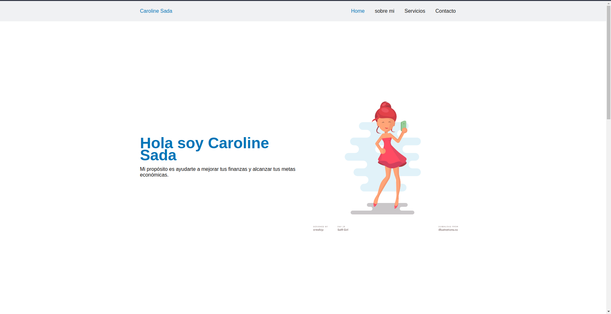

# Influencer Landing page

Solución al reto de la creacion de una landing page para ofertar los servicios de una influencer mediante la metodologia DevOps

para ello se realizaron dos maquetaciones:
- Maquetación con HTML, CSS y JavaScript
- Maquetación con Bootstrap

## Vistas de las maquetaciones

**HTML**

[Deploy de la landing :rocket:](https://influencer-caroline.netlify.app/)

**Bootstrap**

[Deploy de la landing :rocket:](https://influencer-caroline.netlify.app/indexbootsrap)

###### Made with :heart: by JosafatJimenezB